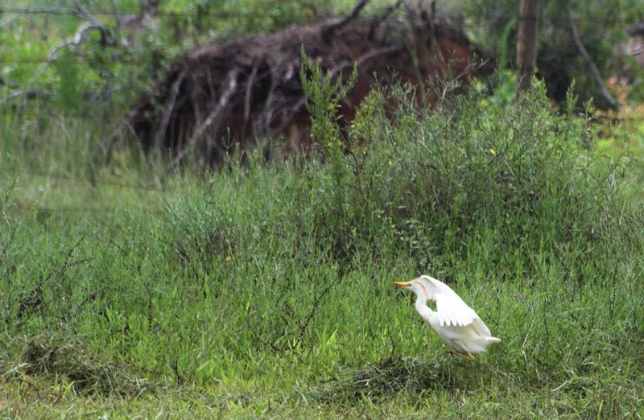
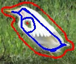
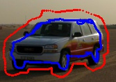

# segmentation-graph-cut

## Introduction
This code implements segmentation using graph cut, specifically, it first converts an image to a graph with edge weights defined by differences of pixels, then I implemented minimum cut/ maximum flow algorithm on the graph to perform segmentation.

## How to run

  ```bash
  git clone https://github.com/ECE-Img-Inpainting/segmentation-graph-cut.git
  cd segmentation-graph-cut
  python segmentation.py
  ```

1. Please change the image path before running.
2. Select a window which encloses the part you want to segment.
3. The pen is initially blue, left click the image to start drawing (put down the pen), and left click the image again to end drawing (put up the pen).
4. Press "x" to change the color of the pen. Press "a" to increase the pencil size, Press "b" to decrease the pencil size.
5. Use blue color to paint foreground object and red color to paint background.
6. Press "q" if you finish drawing, and then the image will be segmented.

## Results

<p float="left">
  
   
  
</p>

<p float="left">
  
   
  
</p>
